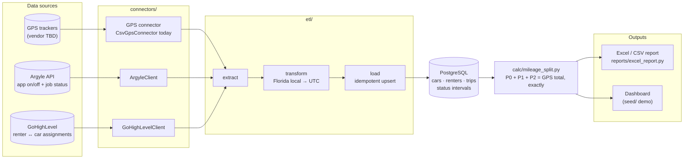
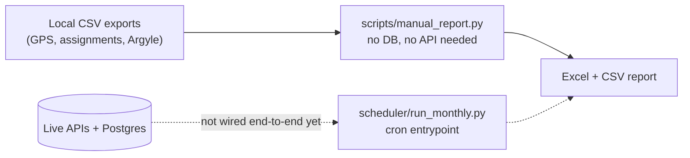

# InsuranceLog

Monthly P0/P1/P2 mileage-split reporting for the insurance carrier.

- **P0** — miles with the app off (personal use)
- **P1** — miles with the app on, not on a job
- **P2** — miles while on a job

The hard requirement: `P0 + P1 + P2` must equal the GPS total exactly, per
car per month. See `calc/mileage_split.py` for how that's enforced.

## Architecture



Two ways to reach the calculation engine today:



`manual_report.py` is what's actually usable right now. `run_monthly.py` is the
target shape for the automated path once the Argyle/GHL field mappings are
confirmed (see "Known open questions" below).

## Current status

Nothing here has touched real data yet — no API credentials, no GPS vendor
confirmed, no client-provided spec/prototype/known-answer example. What's
built:

| Piece | Status |
|---|---|
| Postgres schema (`db/schema.sql`, `db/models.py`) | Ready |
| P0/P1/P2 calculation engine (`calc/mileage_split.py`) | Ready, tested (`tests/`) |
| Excel/CSV report writer (`reports/excel_report.py`) | Ready |
| Manual CLI from local CSVs (`scripts/manual_report.py`) | Ready, smoke-tested against `tests/fixtures/` |
| Argyle client (`connectors/argyle.py`) | Structural only — endpoint paths/field names are placeholders, unverified against a live account |
| GoHighLevel client (`connectors/gohighlevel.py`) | Structural only — `get_rental_records()` is a stub; GHL has no built-in "car rental" object, so we don't yet know if this data lives in Opportunities, a Custom Object, or Contact fields |
| GPS connector (`connectors/gps/`) | `CsvGpsConnector` works today for any vendor's manual export; no vendor confirmed yet, so no API-based connector exists |
| Scheduled full pipeline (`scheduler/run_monthly.py`) | Skeleton only, not wired end-to-end — depends on the two items above |
| Demo dashboard + synthetic seed data (`scripts/seed_data.py`, `scripts/build_dashboard_data.py`) | Ready — generates a realistic month for a 20-car fleet and runs it through the real `calc.mileage_split` engine, so the dashboard numbers are computed, not typed in |

## Get a report out this week

`scripts/manual_report.py` needs no database and no API access — just three
CSVs:

```
python -m scripts.manual_report \
    --gps-csv gps.csv \
    --assignments-csv assignments.csv \
    --argyle-csv argyle.csv \
    --month 2026-06
```

Column formats (see `tests/fixtures/` for working examples):

- **gps-csv**: `device_id, start_time, end_time, miles` — times are Florida
  local, naive (no timezone in the file itself).
- **assignments-csv**: `device_id, car_id, vin, renter_id, start_date, end_date`
  — leave `end_date` blank for an active assignment.
- **argyle-csv**: `renter_id, start_time, end_time, status` — times are UTC,
  `status` is one of `off | on_available | on_job`. Omit `--argyle-csv`
  entirely to get an all-P0 report (i.e. before any Argyle data exists).

Output: `reports/output/mileage_report_<month>.xlsx` and matching `.csv`.

## Demo dashboard (synthetic data)

Before any real GPS/Argyle/GHL access exists, `seed/` demonstrates the whole
pipeline end-to-end on made-up-but-consistent data:

```
python -m scripts.seed_data              # writes seed/*.csv - 20 cars, a month of trips
python -m scripts.build_dashboard_data    # runs them through calc.mileage_split -> seed/dashboard_data.json
```

Every number in `dashboard_data.json` comes from actually running trips
through `split_trip_miles()` — nothing is hand-typed, and the script asserts
`P0 + P1 + P2 == total` at the fleet level before writing the file. The
published dashboard artifact embeds that JSON directly; regenerate the seed
data and re-run `build_dashboard_data` any time you want fresh demo numbers.

## Setup

```
python -m venv .venv
.venv\Scripts\activate          # Windows
pip install -r requirements.txt
copy .env.example .env          # fill in DATABASE_URL etc. once known
```

Run tests:

```
pytest tests/
```

## Known open questions (need the client's spec or direct access to answer)

1. **GPS vendor** — does it have an API, or is CSV export the permanent path?
2. **Argyle field names** — `connectors/argyle.py` and
   `etl/transform.normalize_argyle_activities` use placeholder field names
   (`user_id`, `start_time`, `end_time`, `status`). Confirm against a real
   payload before trusting them.
3. **GoHighLevel data model** — where do car/renter/date-range assignments
   actually live (Opportunities vs. Custom Object vs. Contact fields)?
4. **Overlap precedence** — when a renter's app reports two simultaneous
   statuses (e.g. "available" and "on a job" from overlapping events),
   `calc/mileage_split.py` currently resolves `on_job > on_available > off`.
   This is a guess pending the client's actual spec, which explicitly calls
   out overlapping/ambiguous cases as something to define.
5. **DST fall-back hour** — `etl/transform.py` assumes the second (standard
   time) occurrence of the repeated 1–2am hour each November. Low-volume
   edge case, but worth confirming if exactness matters there too.
6. **The known-correct example** — once the client sends a worked example,
   add it as a fixture in `tests/fixtures/` and a regression test asserting
   the exact expected numbers, the same way the current synthetic tests do.

## Layout

```
config/       environment-driven settings (.env)
db/           Postgres schema + SQLAlchemy models/connection
connectors/   Argyle, GoHighLevel, GPS API clients (base.py has shared paging/retry)
etl/          extract -> transform (timezone normalization) -> load
calc/         the P0/P1/P2 split + exact-reconciliation logic
reports/      Excel/CSV generation
scripts/      manual_report.py - one-off run from local CSVs
              seed_data.py / build_dashboard_data.py - synthetic demo data
scheduler/    run_monthly.py - cron entrypoint for the automated pipeline
tests/        pytest suite + tests/fixtures/ sample CSVs
seed/         generated demo CSVs + dashboard_data.json (gitignored)
```
